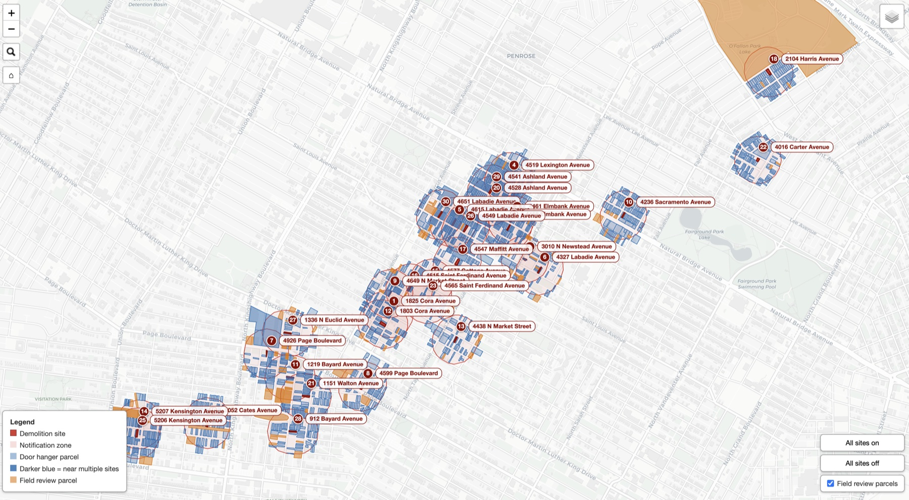
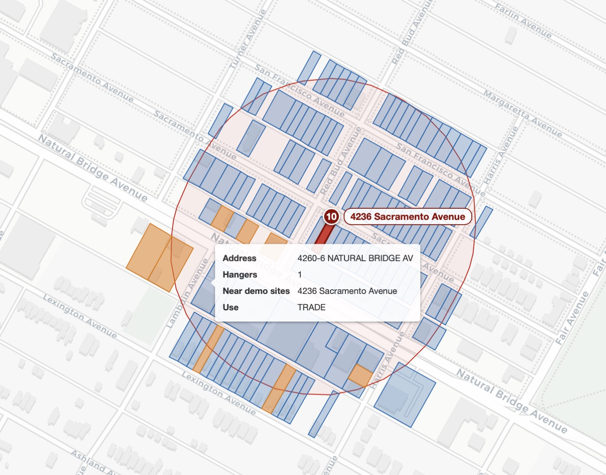

# Demolition Neighbor Notification for St. Louis

**City parcels → 500 ft buffers → door hanger lists** · Turning a demolition site list into a complete neighbor notification package

**Author:** Erin Weiss
[Portfolio](https://erin-weiss.github.io/index.html) | [LinkedIn](https://www.linkedin.com/in/erinweiss3/) | [GitHub](https://github.com/Erin-Weiss)

[](https://github.com/Erin-Weiss/stl-demo-notify/actions/workflows/ci.yml) [](LICENSE) [](https://python.org) [](https://geopandas.org) [](https://python-visualization.github.io/folium/) [](tests/)

---

## Overview

A command-line tool that turns a list of demolition sites into door hanger lists, field walking checklists, and an interactive parcel map, with same-day turnaround on work that takes days by hand.

Demolition work requires notifying the occupants of every structure near each site before work begins. Done manually, that means looking up parcels one at a time on the assessor's website, transcribing addresses, and guessing which lots are vacant. For a 30-site project that is thousands of parcel lookups, and the guesses are the part that gets a contractor in trouble.



---

## The Engagement

Aftermath Disaster Recovery, a returning client, brought a list of 30 demolition sites across north St. Louis and needed a notification plan for each one, starting with a same-day turnaround on the first site. I delivered the analysis as a bespoke script, then generalized it into this installable tool because additional site lists are expected. Any future list now runs with one command.

---

## Results

The full 30-site run produces, in about a minute on a laptop:

| Result | Figure |
| --- | --- |
| Client sites matched to city parcel records | **30 of 30** |
| Unique addresses within 500 ft and believed occupied | **1,636** |
| Door hangers if all sites are noticed together | **2,598** |
| Door hangers if each site is noticed separately | **3,948** |
| Parcels flagged for field review | **134** |

Two print totals appear because the correct order quantity depends on the demolition schedule, which is the client's decision. The lower total covers every address once and applies when all sites are noticed in a single pass. The higher total applies when sites are demolished on separate schedules, because each demolition triggers its own notification and an address near three sites needs three hangers.

The field review parcels are lots the assessor says have no building but where other fields disagree. Rather than silently including or dropping them, the tool flags each one for in-person verification and names the specific fields in conflict.

---

## Technical Approach

### Data

Every run combines the client's site list with three city data sources, because no single source is sufficient. Parcel shapes (`prcl_shape.zip`) carry the polygon geometry for all 126,958 parcels in the city but almost no descriptive information. Land records (`par.zip`) carry the assessor's attributes for each parcel, including site address, building and dwelling unit counts, land use code, vacancy flag, and improvement value, but no geometry. The two are joined on a normalized parcel handle, since the same ID often arrives in different formats on each side. Land use descriptions come from a third source, the city's published Assessor Land Use vocabulary, so every label in the output is traceable to an official record rather than a hand-maintained lookup.

A `prepare-data` command downloads and joins all three once, caching the result locally as GeoParquet. The cache loads in about two seconds, and analysis runs never touch the network.

The client's site list is the fourth input. It arrives as CSV or Excel with whatever column names the client uses, and each site is matched to a city parcel by APN against four city ID fields in priority order, with an address-based fallback for sites that arrive without an APN. Every outcome, including the exact field each site matched on, is written to a match report the client can check.

### Spatial Analysis

Distance work happens in EPSG 26996 (NAD83 Missouri East, meters), a projected coordinate system in which buffer and distance math is accurate. Coordinates convert back to latitude and longitude only at the end, for the web map.

Buffers are measured outward from the demolition parcel's boundary, a rule confirmed with the client and recorded in the assumptions log. Measuring from the parcel's center instead would understate coverage around large lots. The neighbor search runs in two stages. A `GeoPandas` spatial index first narrows 126,958 parcels to the few dozen whose bounding boxes could overlap a site's buffer, then exact `Shapely` polygon intersection runs on that shortlist only. This produces the same result as testing every parcel directly at a small fraction of the cost.

### Decision Rules

Parcels only make the notification list when the assessor's building count shows a structure. When the record contradicts itself, for example a lot with no buildings on record but a vacancy flag of N or a nonzero improvement value, the parcel is flagged for human review, and the flag names the specific conflicting fields, so a field crew knows what to check at the door.

Hanger counts come from the assessor's dwelling unit count, with a minimum of one per address. Walking checklists visit the nearest street first and then follow house numbers within each street, matching how a crew moves through a neighborhood on foot. The assumptions log records this as a heuristic rather than an optimized route.

### The Interactive Map

The map is built with `Folium` on `Leaflet.js`, with custom JavaScript for the controls. Each site is a self-contained toggle layer, so a crew lead can switch everything off and display only the sites scheduled for that day. Field review parcels have their own master toggle, address labels appear at closer zoom levels, every parcel shows its details on hover, and any address can be found by search. The finished map is a single HTML file that opens in any browser without additional software.

Hovering any parcel shows its address, hanger count, nearby demolition sites, and land use, so a crew can answer questions at the door without leaving the map.



---

## Engineering and Reproducibility

Assessor data is treated as unreliable input. Parcel IDs are normalized on both sides of every join, because the same ID can arrive as an integer, a float with a trailing .0, or a string with stray characters, and numeric fields are coerced with explicit fallbacks so one malformed cell cannot crash a run.

Client work arrives in rounds, so the run command refuses to overwrite a directory that already holds output unless replacement is explicitly requested.

The refactor from the original engagement script into this package is validated against the delivered results. The regenerated outputs in [`case-study/`](case-study/) reproduce all four headline figures exactly, and the remaining row-level differences are deliberate improvements made during the refactor, such as sourcing land use labels from the city's official vocabulary instead of a hand-maintained lookup.

The test suite covers the matching and analysis logic using synthetic parcels with known geometry, including a grid where the correct neighbors and distances can be computed by hand. The tests require no network access or city data, finish in under a second, and run with `ruff` linting on every push through GitHub Actions.

---

## Getting Started

```bash
git clone https://github.com/Erin-Weiss/stl-demo-notify.git
cd stl-demo-notify
python3.11 -m venv .venv && source .venv/bin/activate
pip install -e ".[dev]"

stl-demo-notify prepare-data
stl-demo-notify run --input data/sample_input.csv --output-dir output/
```

`prepare-data` builds the local parcel cache with a one-time download of about a minute. The sample input is five sites drawn from the public Aftermath list in `case-study/`. The `run` command accepts CSV or Excel input and auto-detects APN and address columns by common names, with content-based address detection as a fallback.

**Useful flags:**

| Flag | Purpose |
| --- | --- |
| `--buffer` | Notification distance in feet (default 500) |
| `--apn-column`, `--address-column` | Name the columns explicitly when auto-detection misses |
| `--no-map` | Skip the map for a faster numbers-only run |
| `--overwrite` | Required to replace an existing output directory |
| `--group` | Sites demolished together as one notification pass, by 1-based site number; repeatable (e.g. `--group 1,13 --group 5,7`) |
| `--force` (on `prepare-data`) | Re-download the city data and rebuild the cache |

---

## Outputs

Every run writes a complete client deliverable package.

- **`doorhanger_list.csv`** · The master list, one row per unique address. Each row carries the address and ZIP, building and unit counts, the land use code with its official description, the vacancy and improvement fields, the suggested hanger count, every demolition site the address is near, and how many separate notifications it would need.
- **`doorhanger_list.xlsx`** · The master list plus three more sheets. A per-site detail sheet with the distance from each address to each site, the field review list, and the excluded parcels with the reason each one was left off.
- **`field_review_list.csv`** · One row per flagged parcel, naming the specific conflicting assessor fields and every site it sits near, ready to hand to a field crew.
- **`site_checklists.xlsx`** · A summary sheet of per-site address and hanger totals, followed by one printable sheet per site. Each checklist has a done column, walking order, hanger counts, land use, and distance, with that site's field review parcels listed underneath.
- **`match_report.txt`** · How every input site matched a city parcel, including the exact ID field used, or a clear NOT FOUND.
- **`assumptions_log.txt`** · The run's parameters, the headline totals, and the full numbered list of methodology assumptions, written in plain language for the client.
- **`demo_notification_map.html`** · The interactive map described above, shipped with every run.

---

## Project Structure

```
├── .github/workflows/ci.yml         # Lint and tests on every push
├── case-study/
│   ├── aftermath_sites_2026.csv     # The public 30-site client input list
│   ├── originals/                   # Deliverables from the original engagement
│   └── regenerated/                 # The same outputs reproduced by this tool
├── data/
│   ├── landuse_vocabulary.csv       # Official assessor land use codes
│   ├── sample_input.csv             # Five-site sample from the client list
│   └── cache/                       # GeoParquet parcel cache ⚠
├── docs/images/                     # README screenshots
├── src/stl_demo_notify/
│   ├── config.py                    # Data source URLs, CRS, shared constants
│   ├── citydata.py                  # Downloads, parcel cache, vocabulary
│   ├── matching.py                  # APN matching with address fallback
│   ├── analysis.py                  # Buffers, neighbor search, filters, totals
│   ├── outputs.py                   # CSV, Excel, and text report writers
│   ├── mapping.py                   # Interactive map builder
│   └── cli.py                       # prepare-data and run commands
├── tests/
│   ├── test_matching.py             # ID normalization, address parsing, match cascade
│   ├── test_analysis.py             # Filters, hanger totals, walking order
│   └── test_geometry.py             # End-to-end buffer math on a synthetic grid
├── .gitignore
├── LICENSE
├── pyproject.toml
└── README.md

⚠ Built locally by prepare-data, not checked into version control.
```

---

## Tech Stack

| Category | Tools |
| --- | --- |
| Geospatial analysis | `GeoPandas`, `Shapely`, `pyproj`, GeoParquet via `pyarrow` |
| Data handling | `pandas`, `openpyxl` |
| Mapping | `Folium` on `Leaflet.js`, custom JavaScript controls |
| Interface | `argparse` CLI with console entry point |
| Testing and quality | `pytest`, `ruff`, GitHub Actions CI |

---

## Case Study

The original client deliverables and the regenerated outputs that reproduce them are in [`case-study/`](case-study/), along with the public 30-site input list. A formatted case study write-up is in progress.

---

## Future Work

- **Grouped checklists and map** · The `--group` flag already recomputes hanger totals when sites are demolished together; extending grouping to merge those sites' walking checklists and map layers into a single combined pass is the remaining piece
- **Multi-city adapter layer** · Per-jurisdiction configuration for column names, coordinate systems, and download endpoints
- **Route optimization** · A true routing pass for the walking checklists, which currently use a nearest-street heuristic
- **Address-point data** · Refining structure detection on flagged parcels with a second data source
- **Hosted web interface** · Upload a site list, adjust the buffer, and download results from a browser

---

## License

MIT. See [LICENSE](LICENSE).

---

## Author

**Erin Weiss** · [Portfolio](https://erin-weiss.github.io/index.html) · [LinkedIn](https://www.linkedin.com/in/erinweiss3/) · [GitHub](https://github.com/Erin-Weiss)

---

*Generalized from a delivered client engagement into a reusable tool. Geospatial data engineering, parcel-level analysis, and client-ready reporting in one package.*
